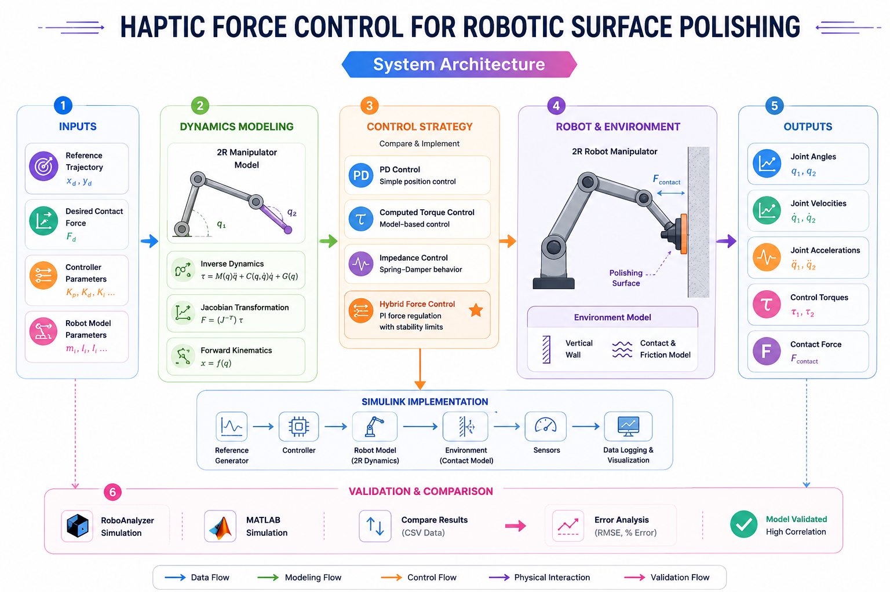
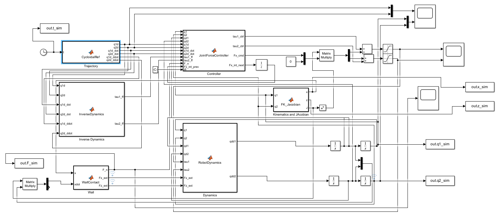
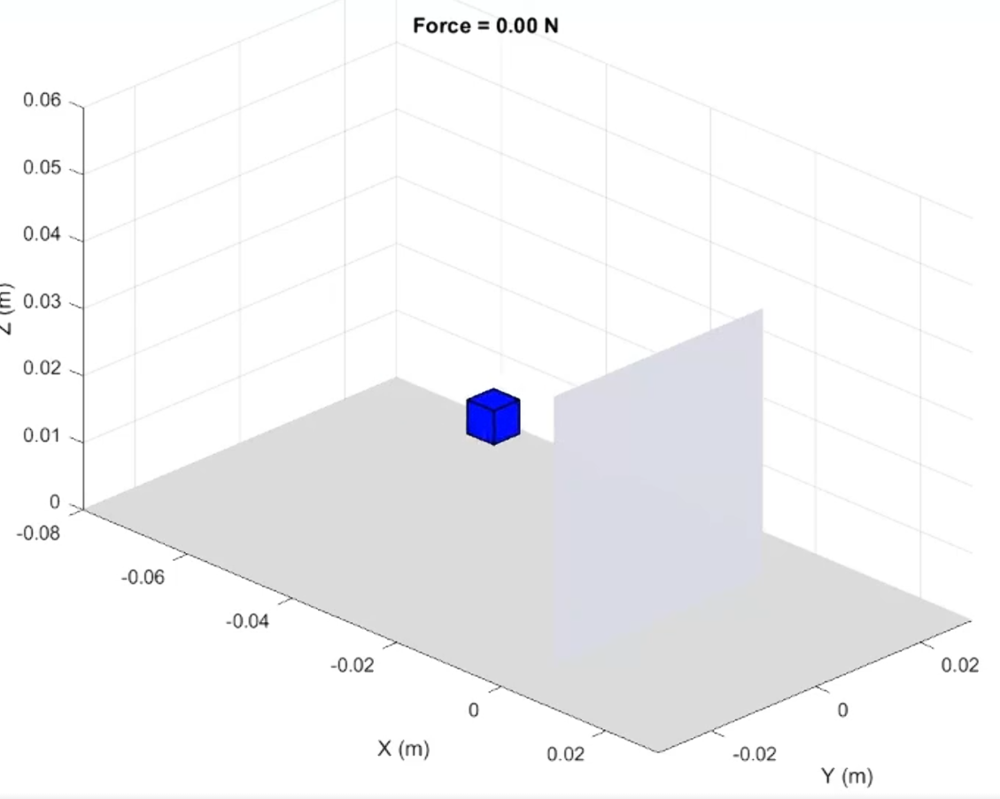
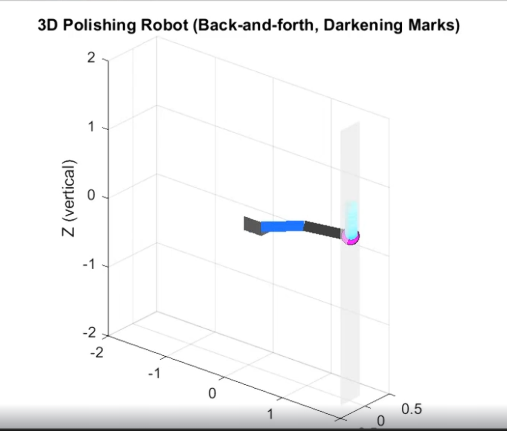

# Haptic-Force-Control-for-Robotic-Surface-Polishing


MATLAB and Simulink implementation of a haptic force-control framework for a 2R robotic manipulator performing surface polishing, including dynamics modeling, controller comparison, and contact-force regulation.


---

## Overview

Industrial polishing, grinding, sanding, and rehabilitation tasks require robots to maintain controlled contact forces while interacting with external environments. Traditional position controllers can achieve accurate motion but often fail when force regulation becomes critical.

This project develops a complete simulation environment for a 2R robotic manipulator performing vertical wall polishing. The framework combines robot dynamics, contact-force modeling, controller design, Simulink implementation, and validation against RoboAnalyzer simulations.

The objective was to investigate different control strategies and identify the most suitable controller for force-sensitive robotic applications.

---

## System Architecture

<p align="center">
  
</p>

The system integrates:

- Dynamic modeling of a 2R manipulator
- Inverse dynamics formulation
- Contact force modeling
- Multiple controller implementations
- Simulink-based simulation
- RoboAnalyzer validation
- Performance comparison and error analysis

---

## Simulation Architecture

<p align="center">
  
</p>

The complete Simulink architecture includes:

- Reference trajectory generation
- Dynamic robot model
- Controller block
- Environment interaction model
- Contact force estimation
- Data logging and visualization

---

## Project Objectives

- Formulate the dynamics of a 2R robotic manipulator
- Simulate robotic surface polishing operations
- Model robot-environment interaction forces
- Compare multiple control approaches
- Achieve stable force regulation during contact
- Validate simulation results using RoboAnalyzer

---

## Methodology

### 1. Robot Dynamics Formulation

The manipulator dynamics were modeled using classical rigid-body dynamics.

Implemented modules:

- Forward Kinematics
- Inverse Kinematics
- Jacobian Matrix
- Dynamic Modeling
- Torque Computation

The robot follows a polishing trajectory while maintaining contact with a vertical wall.

---

### 2. Environment Interaction Model

The wall is modeled as a contact surface generating reaction forces whenever the end-effector penetrates the boundary.

The environment model enables:

- Contact detection
- Force generation
- Force feedback
- Surface interaction analysis

---

### 3. Controller Design

Four control strategies were investigated.

#### PD Control

- Position-based controller
- Simple implementation
- Poor force regulation performance

#### Computed Torque Control

- Model-based controller
- Better trajectory tracking
- Limited force control capability

#### Impedance Control

- Spring-damper behavior
- Smooth interaction
- Safe operation
- Moderate force regulation

#### Hybrid Force Control

- Direct force regulation
- Stable contact interaction
- Precise force tracking
- Best polishing performance

---

## Controller Comparison

<p align="center">
  
</p>

The comparison demonstrates that Hybrid Force Control achieves the most accurate force regulation while maintaining stable contact with the polishing surface.

---

## Robot-Environment Interaction

<p align="center">
  
</p>

The manipulator interacts with a vertical wall while maintaining a desired contact force.

The controller continuously adjusts robot motion to compensate for disturbances and maintain stable polishing behavior.

---

## Results

### MATLAB vs RoboAnalyzer Validation

Simulation outputs were compared against RoboAnalyzer-generated datasets.

Compared parameters include:

- Joint positions
- Joint velocities
- Joint accelerations
- Joint torques

The results demonstrate strong agreement between MATLAB and RoboAnalyzer simulations.

---

### Force Regulation Performance

Key observations:

- Hybrid Force Control achieves the desired force target.
- Impedance Control produces compliant behavior.
- PD and Computed Torque controllers struggle with force regulation.
- Stable contact force is maintained throughout the polishing task.

---

### Position Tracking


The robot successfully follows the polishing trajectory while regulating contact forces.

---

## Demonstration

### Surface Polishing Animation

The animation demonstrates:

- End-effector motion
- Wall interaction
- Contact force regulation
- Polishing trajectory execution


---

## Technologies Used

| Category          | Tools                                        |
| ----------------- | -------------------------------------------- |
| Programming       | MATLAB                                       |
| Simulation        | Simulink                                     |
| Robotics Analysis | RoboAnalyzer                                 |
| Dynamics          | Robot Dynamics                               |
| Control           | PD, Computed Torque, Impedance, Hybrid Force |
| Validation        | MATLAB vs RoboAnalyzer                       |

---

## Applications

* Industrial Surface Polishing
* Robotic Grinding
* Automated Finishing Operations
* Contact-Rich Manipulation
* Haptic Robotics
* Force-Controlled Automation
* Rehabilitation Robotics
* Human-Robot Interaction

---

## Key Contributions

* Developed a complete 2R robot dynamic model
* Implemented contact-force interaction with a vertical wall
* Compared four major control strategies
* Demonstrated superior performance of Hybrid Force Control
* Validated simulation results using RoboAnalyzer
* Built a complete Simulink simulation framework

---

## Future Improvements

Potential extensions include:

* 6-DOF industrial manipulator implementation
* Adaptive force control
* Reinforcement learning-based control
* Real-time hardware deployment
* Digital twin integration
* Advanced haptic interaction models

---

## Author

**Ananya**


---

```
```
